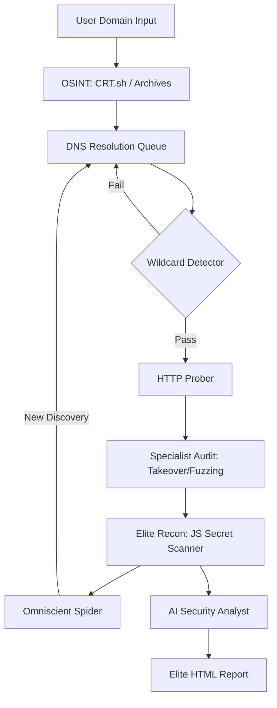

# 🌌 Subdomain Enumerator: Advanced Reconnaissance Framework

[](https://opensource.org/licenses/MIT)
[](https://www.python.org/downloads/)
[](# omniscient-god-mode-infinite-power)

> A devastatingly fast, asynchronous reconnaissance engine designed for modern security auditing and offensive cybersecurity.

---

## 🛠 Features At A Glance

| Tier | Name | Description | Flag |
| :--- | :--- | :--- | :--- |
| **Core** | **Async Engine** | 10,000+ Requests/min DNS & HTTP Probing. | `--probe` |
| **Active** | **Port Scanner** | High-speed TCP Connect scanning for open ports. | `--ports` |
| **Attack** | **Vuln Injector** | Deep XSS/SQLi payload injection for quick wins. | `--inject` |
| **Specialist** | **Pro Audit** | Subdomain Takeover, .env Fuzzing, Tech Fingerprinting. | `--audit` |
| **Elite** | **Deep Recon** | JS Secret Scanning, Wayback Machine, DNS Zone AXFR. | `--elite` |
| **God-Mode** | **Omniscient** | Recursive Spider, Smart Mutation, Autonomous Loops. | `--omni` |

---

## 🌌 Omniscient God-Mode (Infinite Power)

The crowning jewel of this framework. When `--omni` is enabled, the scanner becomes an **autonomous hunter**:

1.  **Internal Spider**: Scrapes the HTML body of every discovered page to extract links and hidden subdomain mentions.
2.  **Smart Mutator**: Predicts infrastructure by generating permutations (e.g., `api-v1` -> `api-v2`, `dev-portal` -> `staging-portal`).
3.  **Recursive Feedback Loop**: Any new subdomain discovered by the Spider or Mutator is **automatically injected back into the scan queue** for full multi-stage auditing.

---

## 🏗 Architecture



---

## 🚀 Getting Started

### 1. Installation
```bash
# Clone the repository
git clone https://github.com/Justin-io/subdomain_enumerator.git
cd subdomain_enumerator

# Setup virtual environment
python3 -m venv venv
source venv/bin/activate

# Install dependencies
pip install -r requirements.txt
```

### 2. Basic Scan
```bash
python3 main.py --domain example.com --wordlist real_wordlist.txt --probe
```

### 3. Full "God-Mode" Audit
```bash
python3 main.py --domain example.com --wordlist real_wordlist.txt --omni --audit --ports --output results.json
```

---

## 📊 Aesthetic Reporting

The framework generates **Premium HTML Reports** featuring:
- **Interactive Data Tables** with search/sort.
- **Security Badges**: Critical (Takeover), High (Secrets), Medium (Sensitive Files).
- **AI Analyst**: An automatic summary generated by GPT-4/Claude via OpenRouter, detailing risks and remedial steps.
- **Visual Logs**: A rich terminal dashboard to track real-time progress.

---

## 🛡 Disclaimer
This tool is for **authorized security testing only**. The developer assumes no liability for misuse, data loss, or legal consequences resulting from the use of this software. **Always obtain explicit permission before scanning.**

---

<p align="center">
  Built with ❤️ by the Advanced Agentic Coding Team<br>
  <b>All credits to Justin, Alexia, and Andrew.</b>
</p>
